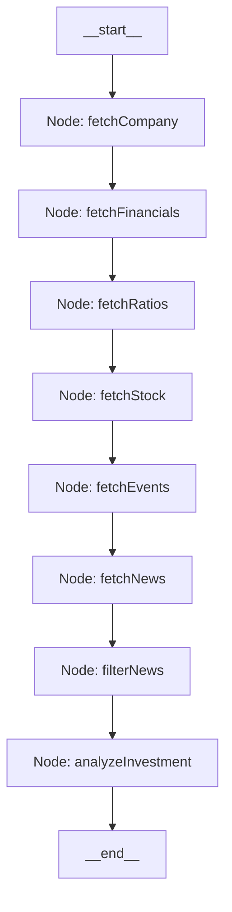

# AI Investment Research Agent

An intelligent full-stack investment assistant that automatically researches any company/ticker, gathers key financial parameters, evaluates recent market sentiment, and generates an investment verdict (`INVEST`, `HOLD`, or `PASS`) with supporting reasoning.

## Overview
This platform implements an autonomous research pipeline powered by **LangGraph** (sequential state graph orchestration), **LangChain**, the **Financial Modeling Prep (FMP) API**, and **Google Gemini (gemini-2.0-flash)**.

The system features:
- **Sequential Research Pipeline**: Structured data collection covering profile summaries, annual financial statements (income, balance, cash flow), financial ratios, key metrics, current/historical stock quotes, earnings calendar events, and raw stock news.
- **AI Sentiment Analysis & Filtering**: Filters raw news to eliminate noise, retains investment-critical stories, and assigns sentiment labels (Positive/Neutral/Negative) and impact ratings (High/Medium/Low).
- **Automated Investment Verdict**: Aggregates all researched parameters to render an investment decision with SWOT breakdowns.
- **Robust Failover Architecture**: Seamlessly switches to offline mock databases for FMP endpoints and AI models if API rate limits (HTTP 429) or quota restrictions are hit.
- **Modern UI**: A premium, clean dashboard built in React using Vite and Chakra UI.

---

## How to Run It

### Prerequisites
Make sure you have [Node.js](https://nodejs.org/) installed (v18+ recommended, tested on v24).

### Environment Configuration
Create a `.env` file in the `server/` directory:
```env
PORT=5000
FMP_API_KEY=your_fmp_api_key_here
FMP_API_URL=https://financialmodelingprep.com/stable
GEMINI_API_KEY=your_gemini_api_key_here
```
*(If no keys are provided or if rate limits are hit, the application automatically enters a mock database mode for top tickers: MSFT, META, AMZN, AAPL, NVDA, TSLA).*

### 1. Run the Backend Server
```bash
cd server
npm install
npm run dev
```
The server will boot up in development mode on port `5000`.

### 2. Run the Frontend Client
```bash
cd client
npm install
npm run dev
```
The Vite development server will start on port `5173`. Open [http://localhost:5173](http://localhost:5173) in your browser.

---

## How It Works

### Approach and Architecture
The backend is structured around a sequence of specialized LangChain tools orchestrated inside a LangGraph `StateGraph`.



1. **Ticker Resolution & Profile Retrieval (`fetchCompany`)**: Resolves arbitrary input (e.g., "Apple" or "AAPL") to primary US listed tickers using a candidate scoring system, then fetches metadata.
2. **Financial Data Pull (`fetchFinancials` & `fetchRatios`)**: Gathers Income Statements, Balance Sheets, Cash Flows, and key ratios (PE, Debt/Equity, ROE).
3. **Market Dynamics (`fetchStock` & `fetchEvents`)**: Retrieves stock quotes, historical prices, and calendar events.
4. **Sentiment Filtering (`filterNews`)**: Uses Gemini model `gemini-2.0-flash` with a JSON schema to filter and classify news.
5. **Verdict Generation (`analyzeInvestment`)**: Evaluates all gathered data to synthesize the investment verdict.

---

## Key Decisions & Trade-offs

* **Sequential LangGraph vs. Fully Autonomous Loops**: We chose a sequential `StateGraph` over an autonomous agent loop. Fully autonomous agents can run into infinite loops, make unnecessary API calls, and exhaust limits rapidly. A sequential graph guarantees a reliable, predictable research pipeline.
* **Mock Database Fallbacks**: Free tier API keys for FMP and Gemini hit strict quotas frequently. We built a robust offline mock backup layer at the service level. If an API request returns an HTTP 429 error, it automatically falls back to in-memory datasets for top tickers.
* **Strict Schema Validation**: Implemented Zod schemas for AI outputs. If the model response fails validation, it throws an error and switches cleanly to a computed financial fallback to avoid page crashes.

---

## Example Runs

### Case 1: Microsoft Corporation (MSFT)
* **Verdict**: `INVEST` (Confidence: 85%)
* **Strengths**: Market-leading cloud infrastructure (Azure), massive cash reserves, front-runner in AI integration (Copilot).
* **Weaknesses**: Premium valuation multiples, PC hardware division headwinds.
* **Reasoning**: MSFT's cloud growth and partnership with OpenAI create a powerful moat. Operating efficiency and stable cash flows justify its valuation.

### Case 2: NVIDIA Corporation (NVDA)
* **Verdict**: `HOLD` (Confidence: 70%)
* **Strengths**: Unmatched dominance in AI hardware, data center growth, high margins.
* **Weaknesses**: Elevated PE ratio relative to historical averages, supply constraints.
* **Reasoning**: While NVDA is the premier provider for AI infrastructure, current valuations reflect massive growth assumptions. Monitoring next quarters for supply/demand balance is prudent.

### Case 3: Tesla Inc. (TSLA)
* **Verdict**: `PASS` (Confidence: 75%)
* **Strengths**: Leader in EV space, strong brand presence.
* **Weaknesses**: Pressure on auto margins from price cuts, declining delivery volumes.
* **Reasoning**: A wait-and-see approach is warranted until auto margins stabilize and autonomous driving software features show significant monetized progress.

---

## What We Would Improve With More Time

1. **RAG Integration**: Index PDF earnings call transcripts, 10-K filings, and investor presentations in a Vector DB (e.g. Chroma/Pinecone) to ground the AI's analysis with deeper qualitative data.
2. **Debating Multi-Agent Architecture**: Setup a "Bull Agent" and a "Bear Agent" that debate the asset's valuation, mediated by a "Moderator Agent" that makes the final decision.
3. **Automated Backtesting**: Add a module that fetches past agent decisions and compares them with actual stock performance over subsequent 3, 6, and 12-month periods to calibrate model heuristics.

---

## BONUS: LLM Chat Transcript Logs
The chat transcripts showing the full development and debugging process with the AI coding assistant are included in the repository inside the `llm_logs/` folder.
